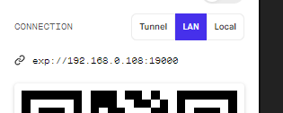

<p align="center">
    
</p>
<p align="center">
    <a href="https://github.com/fajzanetti">
        
    </a>
    <a href="https://www.linkedin.com/in/felipezanetti/">
        
    </a>
    
    
    
    
</p>
<p align="center">
  <a href="#-O-que-é-o-Next-Level-Week?">Next Level Week</a>&nbsp;&nbsp;&nbsp;|&nbsp;&nbsp;&nbsp;
  <a href="#-Projeto">Projeto</a>&nbsp;&nbsp;&nbsp;|&nbsp;&nbsp;&nbsp;
  <a href="#-Tecnologias">Tecnologias</a>&nbsp;&nbsp;&nbsp;|&nbsp;&nbsp;&nbsp;
  <a href="#-Desing">Desing</a>&nbsp;&nbsp;&nbsp;|&nbsp;&nbsp;&nbsp;
  <a href="#-Como-utilizar:">Como Utilizar</a>
</p>

# 🤩 O que é o Next Level Week?

O NLW é uma semana prática com muito código, desafios, networking e um único objetivo: te levar para o próximo nível.

# 🚧 Projeto 
## ♻️ Ecoleta

O Ecoleta é um projeto criado pela [Rocketseat](https://rocketseat.com.br/) com o instrutor [Diego Fernandes](https://github.com/diego3g). :rocket: 
Para gerenciar o processo de coleta de lixo nas cidades. Com ele, é possível ajudar pessoas a encontrarem pontos de coleta de uma forma mais eficiente. Durante esse semana vamos desenvolver um aplicação web e outra mobile que consumiram os dados de uma única API.

# 💾 Tecnologias

- [Node.js](https://nodejs.org/)
- [TypeScript](https://www.typescriptlang.org/)
- [ReactJS](https://reactjs.org)
- [React Native](https://facebook.github.io/react-native/)
- [Expo](https://expo.io/)
> Comando para installar o expo globalmente na máquina: `npm install -g expo-cli`

# 💻 Desing

Link para o Layout do projeto, feito no Figma: [Clique aqui](https://www.figma.com/file/1SxgOMojOB2zYT0Mdk28lB/Ecoleta)

<h1 align="center">
    
</h1>

# 🎓 Como utilizar:

```git
git clone https://github.com/fajzanetti/NLW-01.git
```
Certifique-se de instalar as dependências em todos os arquivos. `npm install`

Para a aplicação mobile funcionar corretamente altere a `baseURL` para o endereço localhost da sua máquina.
> Exemplo de onde conseguir o endereço local na imagem abaixo, com a utilização do expo: 
<div align="center">
    
</div>

## ⚙️ Back-end

```js
`cd Server` //Para entrar na pasta do back-end.

`npm install` //Para instalar todas dependências.

`npm run knex:migrate` //As migrações permitem que você defina conjuntos de alterações de esquema, portanto é fácil atualizar um banco de dados.

`npm run knex:seed` //Os arquivos de seeds permitem preencher seu banco de dados com dados de teste ou propagação independentes dos arquivos de migração.

`npm run dev` //Para iniciar o servidor.
```
> Mais informações sobre o back-end: [Clique aqui](https://github.com/fajzanetti/NLW-01/tree/master/Server#anota%C3%A7%C3%B5es)

## 💻 Front-end

```js
`cd Web` : //Para entrar na pasta do back-end;

`npm install` //Para instalar todas dependências;

`npm start` //Para iniciar o front-end web.
```
> Mais informações sobre o front-end: [Clique aqui](https://github.com/fajzanetti/NLW-01/tree/master/Web#anota%C3%A7%C3%B5es)

## 📱 Mobile

```js
`cd Mobile` : //Para entrar na pasta do back-end;

`npm install` //Para instalar todas dependências;

`npm start / expo start` //Para iniciar a aplicação mobile.
```
> Mais informações sobre o mobile: [Clique aqui](https://github.com/fajzanetti/NLW-01/tree/master/mobile#comando-utilizado-no-projeto)

---

Desenvolvido com 💜 por [Felipe Zanetti!](https://www.linkedin.com/in/felipezanetti/)